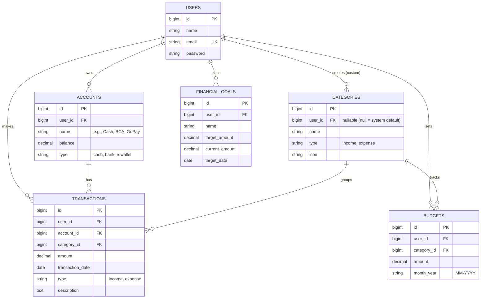

# Database Design — Entity Relationship Diagram

This document describes the database schema of **Personal Finance Tracker** and every Eloquent relationship used in the project.

## 1. Entity Relationship Diagram

## 2. Relationship Summary

| Type | Relationship | Eloquent |
|---|---|---|
| One-to-Many | `User` → `Account` | `hasMany` / `belongsTo` |
| One-to-Many | `User` → `Transaction` | `hasMany` / `belongsTo` |
| One-to-Many | `User` → `Category` | `hasMany` / `belongsTo` |
| One-to-Many | `User` → `Budget` | `hasMany` / `belongsTo` |
| One-to-Many | `User` → `FinancialGoal` | `hasMany` / `belongsTo` |
| One-to-Many | `Account` → `Transaction` | `hasMany` / `belongsTo` |
| One-to-Many | `Category` → `Transaction` | `hasMany` / `belongsTo` |
| One-to-Many | `Category` → `Budget` | `hasOne` / `belongsTo` |
| Has-Many-Through | `User` → `Transaction` through `Account` | `hasManyThrough` |

## 3. Categories (seeded)

The `categories` table is populated by a seeder with the default built-in themes (user_id = null):

| Name | Type | Icon |
|---|---|---|
| Salary | `income` | 💰 |
| Freelance | `income` | 💻 |
| Food & Dining | `expense` | 🍔 |
| Transportation | `expense` | 🚗 |
| Utilities | `expense` | ⚡ |
| Entertainment | `expense` | 🎬 |
| Shopping | `expense` | 🛍️ |
| Health | `expense` | 🏥 |

## 4. Design Notes

- **Category System:** The `categories.user_id` is nullable. If it is `null`, it means the category is a global default provided by the system. If it has a user ID, it is a custom category created by that specific user.
- **Account Balances:** Balances in the `ACCOUNTS` table should be updated automatically whenever a `TRANSACTION` is created, updated, or deleted.
- **Cascade rules:** Deleting a `User` cascades to their accounts, transactions, budgets, goals, and custom categories. Deleting an `Account` will cascade delete its related transactions. Deleting a `Category` is restricted while transactions still use it.